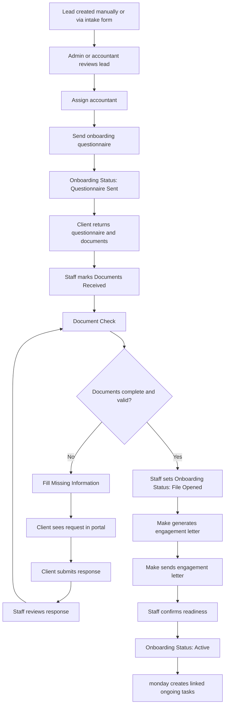
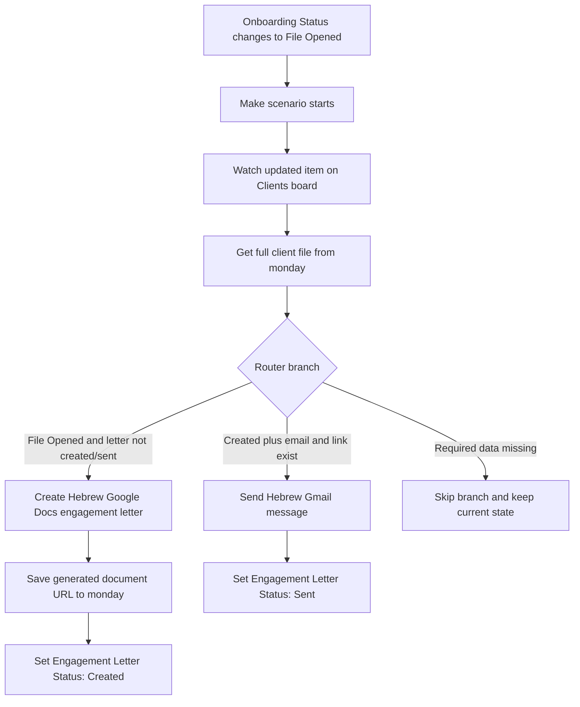
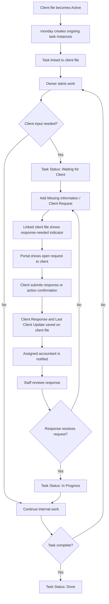
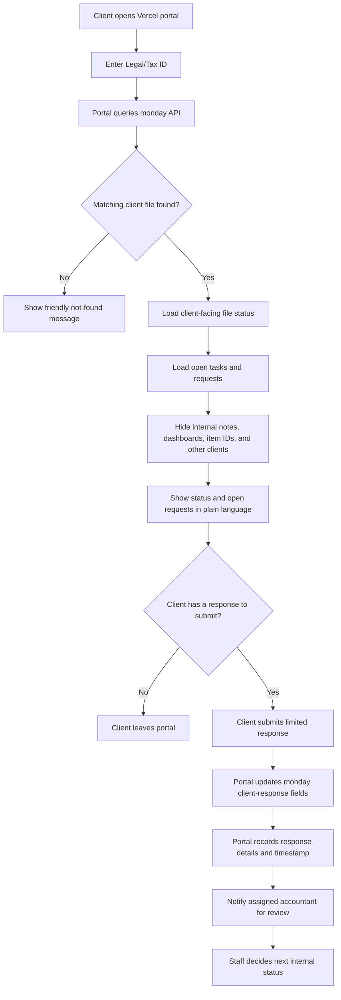

# BringUp Assignment Flowcharts

These Mermaid diagrams describe the main implementation flows for the characterization document.

## Client Onboarding Flow

## Engagement Letter Make Flow

## Ongoing Task And Client Request Flow

## Client Portal Flow

